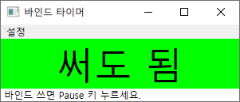

# Bindtimer
메이플스토리 바인드 저항 시간 타이머

## 사용법

Pause 키(보통 Scroll Lock 오른쪽)를 누르면 알림 소리와 함께 92초 타이머(기본 90초 + 여유시간 2초)가 가동됩니다. 시간이 모두 경과되면 알림 소리와 함께 타이머가 '써도 됨' 으로 변경됩니다. 가동 중에도 언제든지 Pause 키를 다시 눌러 재가동할 수 있습니다.
> 여유시간, 단축키를 변경하려면 같은 디렉터리의 BindTimer.ini 파일을 변경하세요.

## 주의사항
관리자 권한으로 실행하지 않으면 게임 중에 단축키가 작동하지 않을 수 있습니다.
